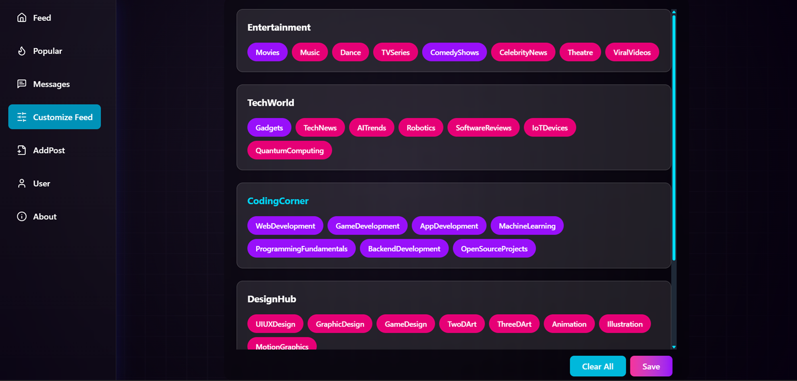
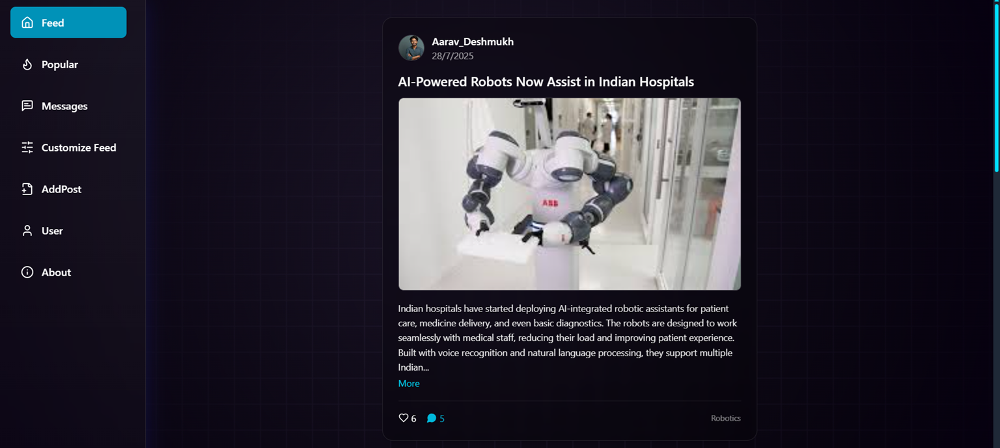
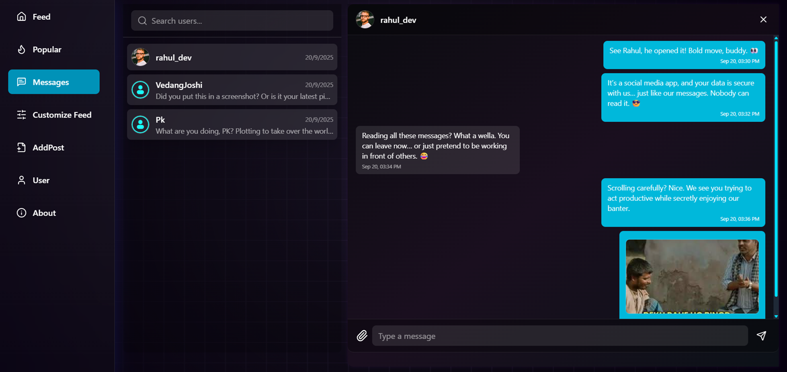
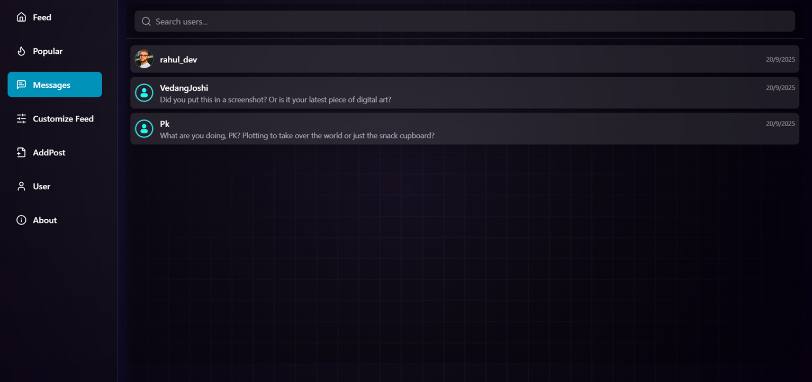
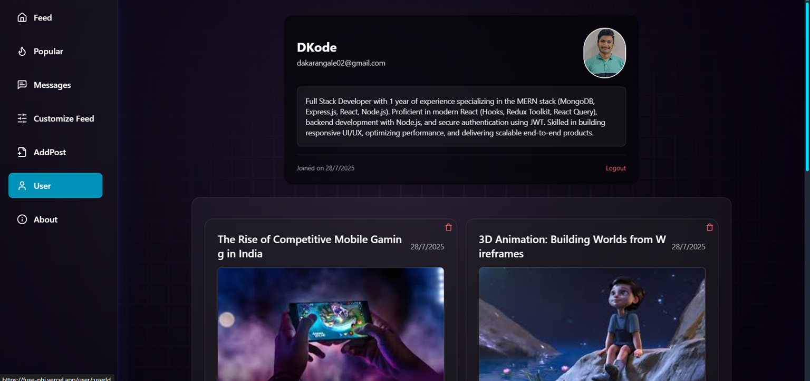

# 🔥 FUSE

[FUSE](https://fuse-phi.vercel.app/) is a modern social media platform focused on **interest-based interaction**, allowing users to post, explore content, and chat in **real-time** with support for **text and media sharing**.

---

## 🚀 Live Demo

👉 [Visit FUSE](https://fuse-phi.vercel.app/)

---

## 📁 Project Structure

```
FUSE/
├── backend/      # Node.js + Express.js server
│   ├── models/
│   ├── routes/
│   └── app.js
├── frontend/     # React TypeScript client
│   ├── public/
│   │   └── Screenshots/  # UI screenshots
│   ├── src/
│   ├── App.tsx
│   └── main.tsx
├── README.md
└── .gitignore
```

---

**Explanation:**
- **backend/**: Handles database, authentication, APIs, and real-time messaging using Socket.IO.  
- **frontend/**: React app with Tailwind CSS, Redux Toolkit, Framer Motion, and Cloudinary integration.  
- **Screenshots**: Stored in `frontend/public/Screenshots` for README preview.

---

## ✨ Key Features

- 📂 **Category-Based Posting**: Post only in predefined categories (UI/UX, Game Design, 2D/3D Art, etc.)  
- 🎯 **Customizable Feed**: Personalized feed based on selected category interests  
- 📈 **Trending Posts**: Displays popular posts across all categories  
- 💬 **Real-Time Messaging**: Instant 1-on-1 chat using WebSocket (Socket.IO) with media support  
- 🖼️ **Cloudinary Integration**: Efficient image uploads for posts and chat  
- 📱 **Responsive UI**: Mobile-first design with smooth Framer Motion animations  
- ⚡ **Optimized Performance**: Lazy loading, infinite scroll, and Redux-based state management  

---

## 🛠️ Tech Stack

### Frontend
- React (TypeScript)
- Tailwind CSS
- Redux Toolkit
- Framer Motion
- React Router
- Cloudinary (for image uploads)

### Backend
- Node.js + Express.js
- PostgreSQL + Sequelize
- Socket.IO (WebSocket-based real-time messaging)
- JWT & bcrypt (Authentication)
- RESTful APIs

---

## 🖼️ Screenshots

| Customize Feed | Feed |
|----------------|------|
|  |  |

| Message | Messages | User Profile |
|---------|----------|--------------|
|  |  |  |

---

## ⚡ Step-by-Step Instructions to Run Locally

### 1️⃣ Clone the repository

```bash
git clone https://github.com/yourusername/fuse.git
cd fuse
```

### 2️⃣ Backend Setup

1. Navigate to backend folder:

```bash
cd backend
```

2. Install dependencies:

```bash
npm install
```

3. Create a `.env` file in `backend/`:

```env
PORT=1000
JWT_SECRET=your_jwt_secret
EMAIL=your_email@example.com
EMAILPASS=your_email_password
DB_HOST=localhost
DB_NAME=fuse
DB_USER=your_db_user
DB_PASSWORD=your_db_password
DB_PORT=5432
CLOUD_NAME=your_cloudinary_cloud_name
CLOUD_API_KEY=your_cloudinary_api_key
CLOUD_API_SECRET=your_cloudinary_api_secret
```

4. Start backend server:

```bash
npm run dev
```

Your backend should now be running at: `http://localhost:1000`

---

### 3️⃣ Frontend Setup

1. Open a **new terminal** and navigate to frontend:

```bash
cd frontend
```

2. Install dependencies:

```bash
npm install
```

3. Create a `.env` file in `frontend/`:

```env
VITE_URL_BASE=http://localhost:1000
VITE_CLOUD_NAME=your_cloudinary_cloud_name
VITE_UPLOAD_PRESET=your_cloudinary_upload_preset
```

4. Start frontend server:

```bash
npm run dev
```

You can now open the app in your browser at the URL shown in the terminal, e.g., `http://localhost:5173`

---

## 📦 Additional Notes

- Ensure PostgreSQL is running locally and the database `fuse` exists.  
- Cloudinary is used for image uploads. Make sure the credentials are correct.  
- Both frontend and backend must be running simultaneously for real-time messaging and API functionality.  

---

## 📂 Repository

[GitHub Repo](https://github.com/yourusername/fuse)

---

## ⚙️ Environment Variables Summary

### Frontend (.env)
```
VITE_URL_BASE=http://localhost:1000
VITE_CLOUD_NAME=your_cloudinary_cloud_name
VITE_UPLOAD_PRESET=your_cloudinary_upload_preset
```